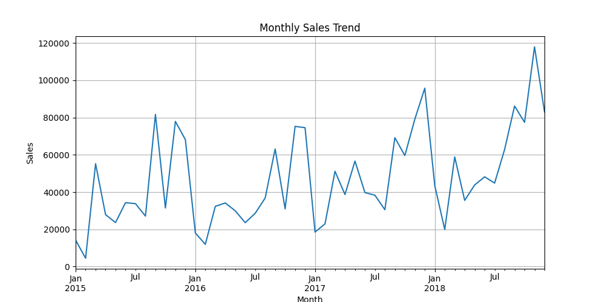
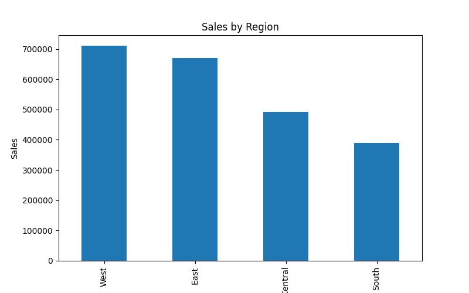
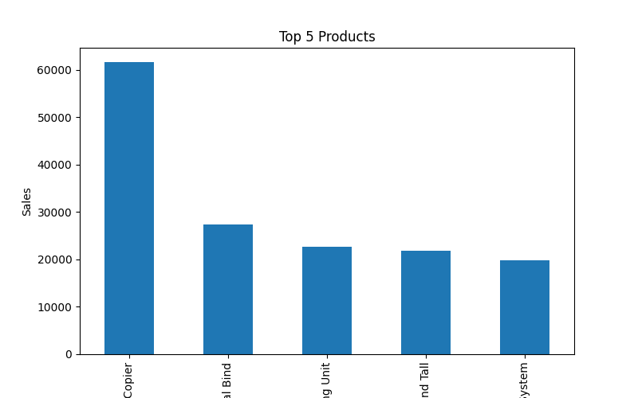

# Sales & Revenue Performance Dashboard

## Project Overview
This project focuses on analyzing sales data to uncover business insights and build an interactive dashboard for decision-making.
The solution includes data cleaning using Python and data visualization using Power BI, providing a complete end-to-end analytics workflow.

## Tools Used
- Python (Pandas,NumPy)
- Power BI
- GitHub

## Features
- Data cleaning and preprocessing
- KPI calculations (Revenue, Orders, AOV)
- Interactive dashboard with filters
- Monthly sales trend analysis
- Business insights generation

## Dashboard Insights
- West region generates highest revenue
- Technology category dominates sales
- Sales peak during Q4 months
- Top products contribute major revenue share


## Dashboard Visualizations

### Monthly Sales Trend


### Sales by Region


### Top 5 Products


## Project Structure
- `data/` → raw dataset
- `scripts/` → Python code
- `output/` → cleaned data
- `dashboard/` → Power BI dashboard

## How to Run
1. Run Python script:
```bash
python scripts/clean_data.py
```
2: Open Dashboard
Open the .pbix file in Power BI
Explore interactive visuals and filters
